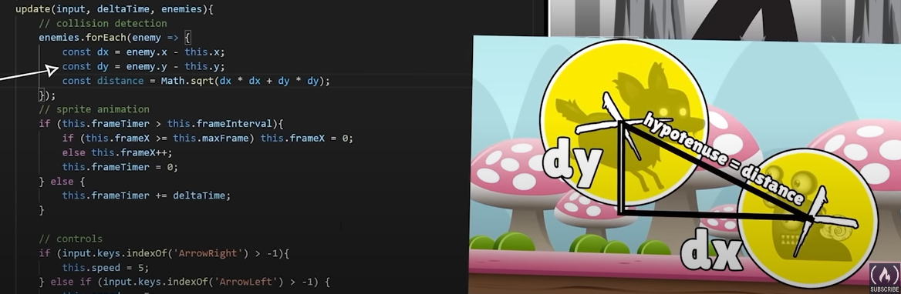
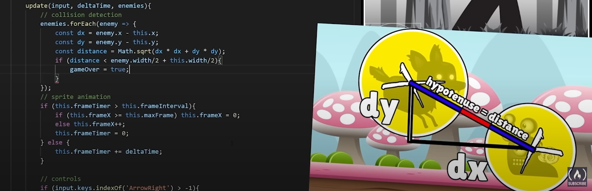

# Part 07 - Javascript 2D Game

Building block for a game:

```js
window.addEventListener("load", function () {
  const canvas = document.getElementById("canvas1");
  const ctx = canvas.getContext("2d");
  canvas.width = 800;
  canvas.height = 720;

  class inputHandler {

  }

  class Player {

  }

  class Background {

  }

  class Enemy {

  }

  function  handleEnemies() {

  }

  function displayStatusText(){

  }

  function animate(){
    
  }
})
```

console logging e we get access to different values inside the event, in this case we are interested the 'key' value, (the key being presed) so that we can call that value from our code:

```js 
window.addEventListener('keydown', function(e){
        console.log(e.key)
      })
```

---



```js
      // collision detection
    enemies.forEach(enemy => {
        const dx = enemy.x - this.x
        const dy = enemy.y - this.y
        const distance = Math.sqrt(dx*dx+dy*dy)
        if (distance < enemy.width *0.5 + this.width*0.5){
          gameOver = true
        }
      })
```


***ES6 arrow function dont bind their own 'this' but they inherit 'this' from their parent scope, also known as 'lexical scoping'.***

Reset css and make width and height responsive:

```css
* {
    margin: 0;
    padding: 0;
    box-sizing: border-box;
}
#canvas1 {
    max-width: 100%;
    max-height: 100%;
}
```

5:39:58

```js
  class inputHandler {
    constructor() {
      this.keys = [];
      this.touchY = ''
      this.touchThreshold = 30
      window.addEventListener("keydown", (e) => {
        if (
          (e.key === "ArrowDown" ||
            e.key === "ArrowUp" ||
            e.key === "ArrowLeft" ||
            e.key === "ArrowRight") &&
          this.keys.indexOf(e.key) === -1
        ) {
          this.keys.push(e.key);
        } else if (e.key === 'Enter' && gameOver) restartGame()
        // console.log(e.key, this.keys);
      });
      window.addEventListener("keyup", (e) => {
        if (
          e.key === "ArrowDown" ||
          e.key === "ArrowUp" ||
          e.key === "ArrowLeft" ||
          e.key === "ArrowRight"
        ) {
          this.keys.splice(this.keys.indexOf(e.key), 1);
        }
        // console.log(e.key, this.keys);
      });
      window.addEventListener('touchstart', e => {
        // console.log('touchstart')
        // console.log(e)
        // console.log(e.changedTouches[0].pageY)
        this.touchY = e.changedTouches[0].pageY
      })
      window.addEventListener('touchmove', e => {
        // console.log('touchmove')
        // console.log(e)
        console.log(e.changedTouches[0].pageY)
      })
      window.addEventListener('touchend', e => {
        // console.log('touchend')
        // console.log(e)
        console.log(e.changedTouches[0].pageY)
      })
    }
  }
```

document.fullScreenElement is a built in read only prop on documentobject that returns the element that is currently being presented in full screen mode. If it's null it means full screen not active

```js
function toggleFullScreen(){
    console.log(document.fullscreenElement)
  }
  toggleFullScreen()
  ```

.requestFullscreen() method is asynchronous and returns a Promise

'`' Template literals
simple way to combine strings of text and expressions that need to be avaluated into a single line of text.

- simpler syntax for embedding ${expressions} in strings
- can do other things, they aren't string literals and cant be used everywhere a string literal can.

Hit box visual:

```js
   draw(context) {

      // Hit Box
      context.lineWidth = 5
      context.strokeStyle = "white";
      // context.strokeRect(this.x, this.y, this.width, this.height);

      // lets use a circle
      context.beginPath()

      // the visual representation of hitbox, shape, size and position, these values should match the collider detector below in update method
      context.arc(this.x +this.width*0.5, this.y + this.height*0.5 + 20, this.width*0.3, 0, Math.PI * 2)

      context.stroke()
      // context.strokeStyle = "blue";
      // context.beginPath()
      // context.arc(this.x, this.y, this.width*0.5, 0, Math.PI * 2)
      // context.stroke()
      context.drawImage(
        this.image,
        this.frameX * this.width,
        this.frameY * this.height,
        this.width,
        this.height,
        this.x,
        this.y,
        this.width,
        this.height
      );
    }
```

End of lesson code:

```js
window.addEventListener("load", function () {
  const canvas = document.getElementById("canvas1");
  const ctx = canvas.getContext("2d");
  canvas.width = 1400;
  canvas.height = 720;

  let enemies = [];
  let score = 0;
  let gameOver = false

  const fullScreenButton = document.getElementById('fullScreenButton')
  

  class inputHandler {
    constructor() {
      this.keys = [];
      this.touchY = ''
      this.touchThreshold = 30
      window.addEventListener("keydown", (e) => {
        if (
          (e.key === "ArrowDown" ||
            e.key === "ArrowUp" ||
            e.key === "ArrowLeft" ||
            e.key === "ArrowRight") &&
          this.keys.indexOf(e.key) === -1
        ) {
          this.keys.push(e.key);
        } else if (e.key === 'Enter' && gameOver) restartGame()
        // console.log(e.key, this.keys);
      });
      window.addEventListener("keyup", (e) => {
        if (
          e.key === "ArrowDown" ||
          e.key === "ArrowUp" ||
          e.key === "ArrowLeft" ||
          e.key === "ArrowRight"
        ) {
          this.keys.splice(this.keys.indexOf(e.key), 1);
        }
        // console.log(e.key, this.keys);
      });
      window.addEventListener('touchstart', e => {
        this.touchY = e.changedTouches[0].pageY
      })
      window.addEventListener('touchmove', e => {
        const swipeDistance = e.changedTouches[0].pageY -this.touchY
        if (swipeDistance < -this.touchThreshold && this.keys.indexOf('swipe up') === -1) this.keys.push('swipe up')
          else if (swipeDistance > this.touchThreshold&& this.keys.indexOf('swipe down') === -1) this.keys.push('swipe down')
        if (gameOver) restartGame()
      })
      window.addEventListener('touchend', e => {
    //  console.log(this.keys)
    this.keys.splice(this.keys.indexOf('swipe up'), 1)
    this.keys.splice(this.keys.indexOf('swipe down'), 1)
      })
    }
  }

  class Player {
    constructor(gameWidth, gameHeight) {
      this.gameWidth = gameWidth;
      this.gameHeight = gameHeight;
      this.width = 200;
      this.height = 200;
      this.x = 100;
      this.y = this.gameHeight - this.height;
      // this.image = document.getElementById('playerImage') // as learned in previous lesson we can just pass the id
      this.image = playerImage;
      this.frameX = 0;
      this.maxFrame = 8;
      this.frameY = 0;
      this.fps = 20;
      this.frameTimer = 0;
      this.frameInterval = 1000 / this.fps;
      this.speed = 0;
      this.vy = 0;
      this.weight = 1;
    }
    restart(){
      this.x = 100
      this.y = this.gameHeight - this.height
      this.maxFrame = 8;
      this.frameY = 0;
    }
    draw(context) {

      // Hit Box
      // context.lineWidth = 5
      // context.strokeStyle = "white";
      // context.beginPath()
      // context.arc(this.x +this.width*0.5, this.y + this.height*0.5 + 20, this.width*0.3, 0, Math.PI * 2)
      // context.stroke()

      context.drawImage(
        this.image,
        this.frameX * this.width,
        this.frameY * this.height,
        this.width,
        this.height,
        this.x,
        this.y,
        this.width,
        this.height
      );
    }
    update(input, deltaTime, enemies) {
      // collision detection
      enemies.forEach(enemy => {
        const dx = (enemy.x + enemy.width*0.5 - 20 ) - (this.x + this.width*0.5)
        const dy = (enemy.y + enemy.height*0.5 ) - (this.y + this.height*0.5 + 20)
        const distance = Math.sqrt(dx*dx+dy*dy)
        if (distance < enemy.width *0.4 + this.width*0.3){
          gameOver = true
        }
      })
      // sprite anmiation
      if (this.frameTimer > this.frameInterval) {
        if (this.frameX >= this.maxFrame) this.frameX = 0;
        else this.frameX++;
        this.frameTimer = 0;
      } else {
        this.frameTimer += deltaTime;
      }

      // controls
      if (input.keys.indexOf("ArrowRight") > -1) {
        this.speed = 5;
      } else if (input.keys.indexOf("ArrowLeft") > -1) {
        this.speed = -5;
      } else if ((input.keys.indexOf("ArrowUp") > -1 || input.keys.indexOf("swipe up") > -1 ) && 
      this.onGround()) {
        this.vy -= 32;
      } else {
        this.speed = 0;
      }
      // horizontal movement
      this.x += this.speed;
      if (this.x < 0) this.x = 0;
      else if (this.x > this.gameWidth - this.width)
        this.x = this.gameWidth - this.width;

      //vertical
      this.y += this.vy;
      if (!this.onGround()) {
        this.vy += this.weight;
        this.maxFrame = 5; // state change between animation sets
        this.frameY = 1;
      } else {
        this.vy = 0;
        this.maxFrame = 8; // state change between animation sets
        this.frameY = 0;
      }
      if (this.y > this.gameHeight - this.height)
        this.y = this.gameHeight - this.height;
    }
    onGround() {
      return this.y >= this.gameHeight - this.height;
    }
  }

  class Background {
    constructor(gameWidth, gameHeight) {
      this.gameWidth = gameWidth;
      this.gameHeight = gameHeight;
      this.image = backgroundImage;
      this.x = 0;
      this.y = 0;
      this.width = 2400;
      this.height = 720;
      this.speed = 3;
    }
    draw(context) {
      context.drawImage(this.image, this.x, this.y, this.width, this.height);
      context.drawImage(
        this.image,
        this.x + this.width - this.speed,
        this.y,
        this.width,
        this.height
      );
    }
    update() {
      this.x -= this.speed;
      if (this.x < 0 - this.width) this.x = 0;
    }
    restart(){
      this.x = 0
    }
  }

  class Enemy {
    constructor(gameWidth, gameHeight) {
      this.gameWidth = gameWidth;
      this.gameHeight = gameHeight;
      this.width = 160;
      this.height = 119;
      this.image = enemyImage;
      this.x = this.gameWidth;
      this.y = this.gameHeight - this.height;
      this.frameX = 0;
      this.maxFrame = 5;
      this.fps = 20;
      this.frameTimer = 0;
      this.frameInterval = 1000 / this.fps;
      this.speed = 8;
      this.markedForDeletion = false;
    }
    draw(context) {
      // Hit Box
      context.lineWidth = 5
      context.strokeStyle = "white";
      context.beginPath()
      context.arc(this.x +this.width*0.5 - 20, this.y + this.height*0.5, this.width*0.4, 0, Math.PI * 2)
      context.stroke()

      context.drawImage(
        this.image,
        this.frameX * this.width,
        0,
        this.width,
        this.height,
        this.x,
        this.y,
        this.width,
        this.height
      );
    }
    update(deltaTime) {
      if (this.frameTimer > this.frameInterval) {
        if (this.frameX >= this.maxFrame) this.frameX = 0;
        else this.frameX++;
        this.frameTimer = 0;
      } else {
        this.frameTimer += deltaTime;
      }

      this.x -= this.speed;
      if (this.x < 0 - this.width) {
      this.markedForDeletion = true;
      score++;
      }
    }
  }

  function handleEnemies(deltaTime) {
    if (enemyTimer > enemyInterval + randomEnemyInterval) {
      enemies.push(new Enemy(canvas.width, canvas.height));
      randomEnemyInterval = Math.random() * 1000 + 500;
      enemyTimer = 0;
    } else {
      enemyTimer += deltaTime;
    }
    enemies.forEach(enemy => {
      enemy.draw(ctx);
      enemy.update(deltaTime);
    });
    enemies = enemies.filter((enemy) => !enemy.markedForDeletion);
  }

  function displayStatusText(context) {
    context.textAlign = 'left'
    context.font = "40px Helvetica";
    context.fillStyle = "black";
    context.fillText("Score: " + score, 20, 50);

    context.fillStyle = "white";
    context.fillText("Score: " + score, 22, 48);
    if (gameOver){
      context.textAlign = 'center'
      context.fillStyle = 'black'
      context.fillText('Yufukup! Press "Enter" or swipe down to restart.', canvas.width*0.5, 200)
      context.fillStyle = 'white'
      context.fillText('Yufukup! Press "Enter" or swipe down to restart.', canvas.width*0.5 + 2, 200)
    }
  }


  function restartGame(){
    player.restart()
    background.restart()
     enemies = [];
     score = 0;
     gameOver = false
     animate(0)
  }

  function toggleFullScreen(){
    console.log(document.fullscreenElement)
    if (!document.fullscreenElement) {
      canvas.requestFullscreen().catch(err => {
        alert(`Error, can't enable full-screen: ${err.message}`)
      })
    } else {
      document.exitFullscreen()
    }
  }
  fullScreenButton.addEventListener('click', toggleFullScreen)
  

  const input = new inputHandler();
  const player = new Player(canvas.width, canvas.height);
  const background = new Background(canvas.width, canvas.height);
  // const enemy1 = new Enemy(canvas.width, canvas.height)

  let lastTime = 0;
  let enemyTimer = 0;
  let enemyInterval = 1000;
  let randomEnemyInterval = Math.random() * 1000 + 500;

  function animate(timeStamp) {
    const deltaTime = timeStamp - lastTime;
    lastTime = timeStamp;
    // console.log(deltaTime)
    ctx.clearRect(0, 0, canvas.width, canvas.height);
    background.draw(ctx);
    background.update();
    player.draw(ctx);
    player.update(input, deltaTime, enemies);
    // enemy1.draw(ctx)
    // enemy1.update()
    handleEnemies(deltaTime);
    displayStatusText(ctx)
    if (!gameOver) requestAnimationFrame(animate);
  }
  animate(0);
});
```

Below is the spritesheet used in this example:
> Art courtesy of [Bevouliin](https://bevouliin.com/category/free_game_asset/)
